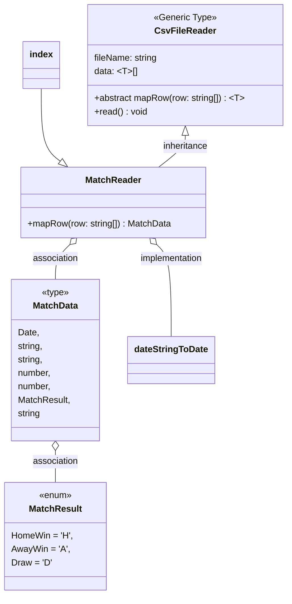

## Inheritance Design Pattern

```mermaid
   classDiagram
   index --|> MatchReader
   CsvFileReader <|--MatchReader: inheritance
   class CsvFileReader {
   <<Generic Type>>
   fileName: string
   data: ~T~[]
   +abstract mapRow(row: string[]) ~T~
   +read() void
   }
   class MatchReader{
   +mapRow(row: string[]) MatchData
   }
   MatchReader o-- MatchData: association
   class MatchData{
   <<type>>
   Date,
   string,
   string,
   number,
   number,
   MatchResult,
   string
   }
   class MatchResult{
   <<enum>>
   HomeWin = 'H',
   AwayWin = 'A',
   Draw = 'D'
   }
   MatchData o-- MatchResult: association
   MatchReader o-- dateStringToDate: implementation
```
