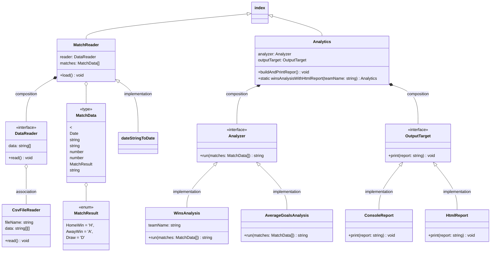
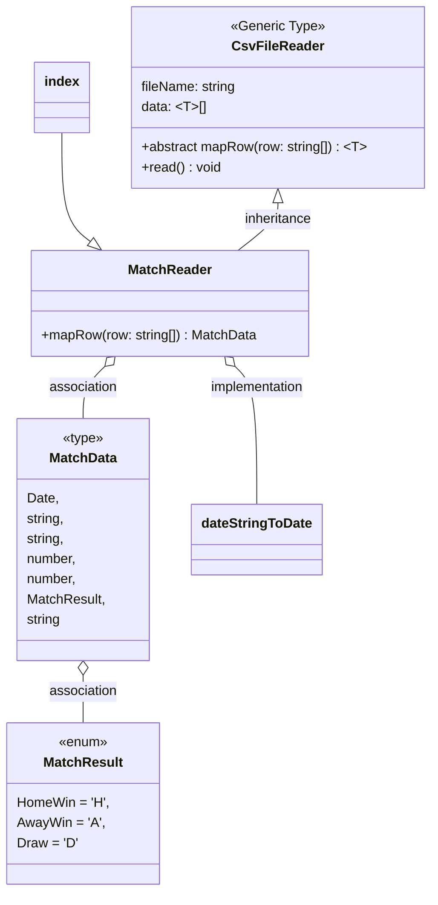

# Pure TypeScript Example

### Setup
1. `npm install`
2. `npm run dev`

### Branch description
  - **main & TS-reusable-2-interface**: utilizing object composition design pattern to resolve reusable code issue;
  - **JS-reg-solution**: solution without reusable code
  - **TS-enum**: use enum to simplify match results
  - **TS-refactor**: refactor into class and methods
  - **TS-reusable-1-abs-Gen**: implement inheritance design pattern with abstract class and generic feature to resolve code re-usability issue

## Composition Design Pattern

## Inheritance Design Pattern

